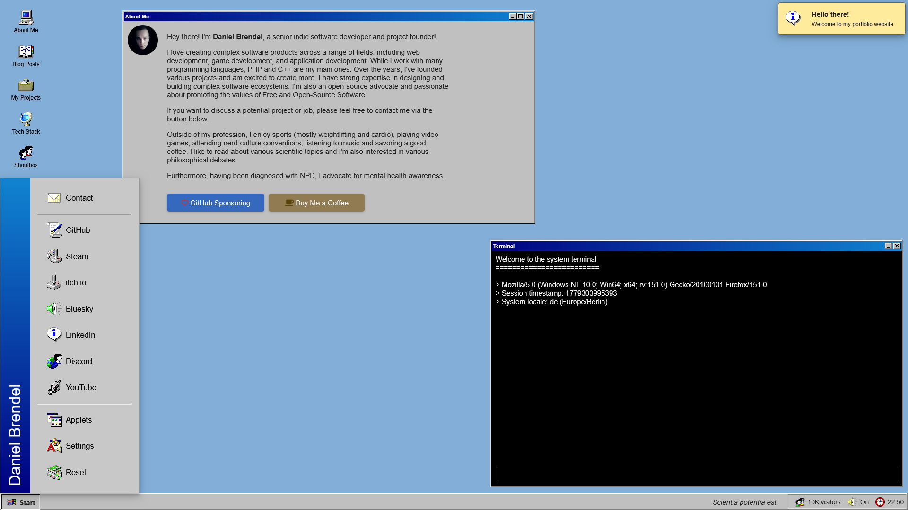

# Daniel Brendel Portfolio App

## Information

(C) 2019 - 2025 by Daniel Brendel

**Version**: 1.0\
**Codename**: dnyPortfolioApp\
**Contact**: dbrendel1988(at)gmail(dot)com\
**GitHub**: https://github.com/danielbrendel/

## Description
This is my personal portfolio application designed as a [web desktop](https://en.wikipedia.org/wiki/Web_desktop). Its GUI resembles old Windows versions for the maximum nostalgic experience. The project also features an applet system, so you can manage applets from web resources dynamically.

## Tech stack

The following technologies are used for this project.

| Technology  | Notes | Link |
| ------------- | ------------- | ------------- |
| PHP | General-purpose scripting language geared towards the web | [https://www.php.net](https://www.php.net) |
| Asatru PHP  | A lightweight PHP framework  | [https://www.asatru-php.com](https://www.asatru-php.com) |
| MariaDB  | Relational database management system  | [https://github.com/MariaDB/server](https://github.com/MariaDB/server) |
| Composer  | Dependency manager for PHP  | [https://getcomposer.org](https://getcomposer.org) |
| phpmailer/phpmailer | E-Mail sending library for PHP | [https://github.com/PHPMailer/PHPMailer](https://github.com/PHPMailer/PHPMailer) |
| nesbot/carbon  | API extension library for PHP DateTime  | [https://github.com/briannesbitt/Carbon](https://github.com/briannesbitt/Carbon) |
| npm | Package manager for JavaScript | [https://www.npmjs.com](https://www.npmjs.com) |
| webpack | A bundler for JavaScript and other assets | [https://github.com/webpack/webpack](https://github.com/webpack/webpack) |
| Bulma  | A modern CSS framework  | [https://bulma.io](https://bulma.io) |
| 98.css  | A design system for old UIs   | [https://github.com/jdan/98.css](https://github.com/jdan/98.css) |
| FontAwesome  | A popular icon library  | [https://fontawesome.com](https://fontawesome.com) |

## System requirements

- PHP ^8.3
- MariaDB ^11.4

## Disclaimer

This project uses Windows 9x icons from [win98icons.alexmeub.com](https://win98icons.alexmeub.com) (C) by Microsoft Corporation.
